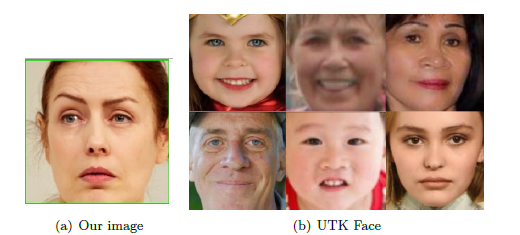
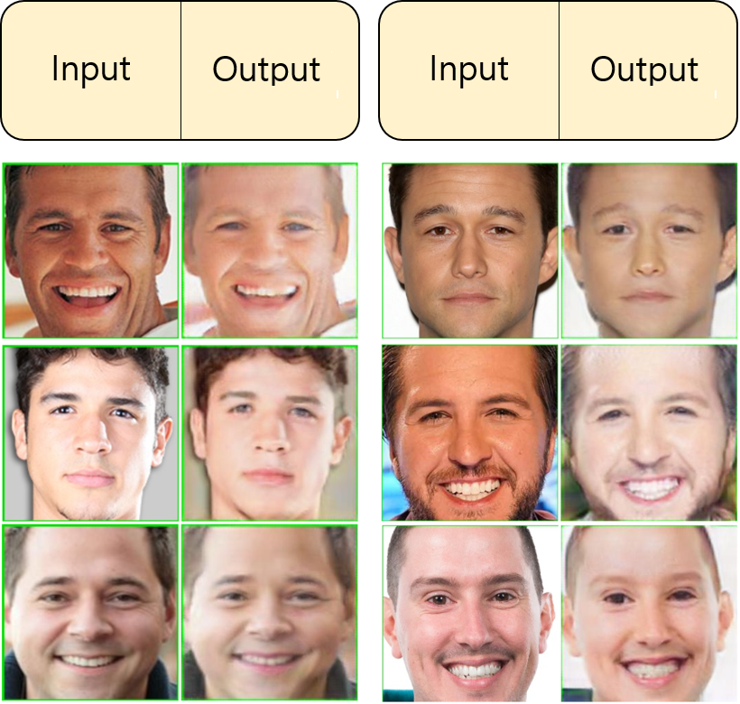
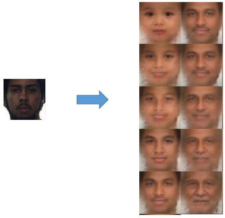
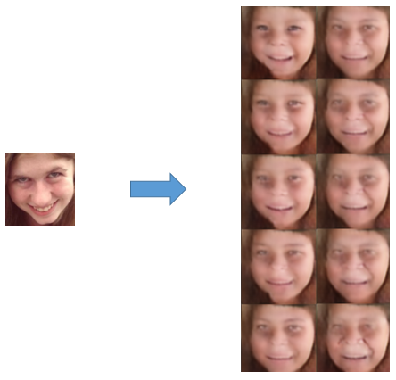
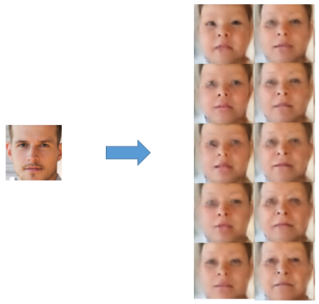

# 2018Fall_DL_project
SNU graduate DL project. Using UTK_Face data, it aims to make person's image young.

## Date 
2018_fall Deep Learning Course Final project(2018-12-17)

## Members
YeongJunHan, Yuntae Kang

## Methods
Based on web_crawling and face detection,
- Cycle-GAN (https://github.com/xhujoy/CycleGAN-tensorflow)
- CAAE (https://github.com/ZZUTK/Face-Aging-CAAE)

## Data

- Web crawling
- Face detection

## Cycle-GAN results

- Good results for Cycle-GAN
- Each images are featured the baby's things.

## CAAE results

## References
- Unpaired Image-to-Image Translation using Cycle-Consistent Adversarial Networks
- Age Progression/Regression by Conditional Adversarial Autoencoder.
- Decoupled Learning for Conditional Adversarial Networks
